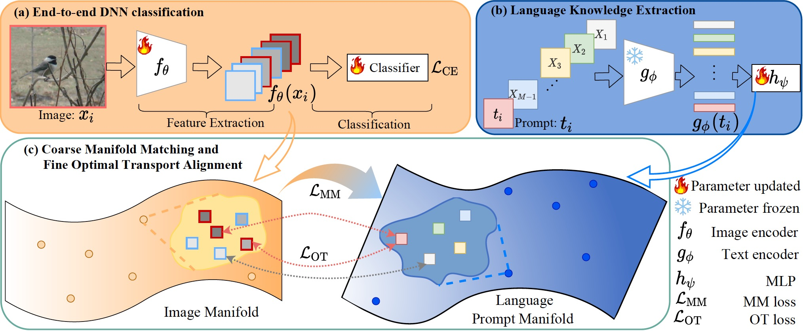
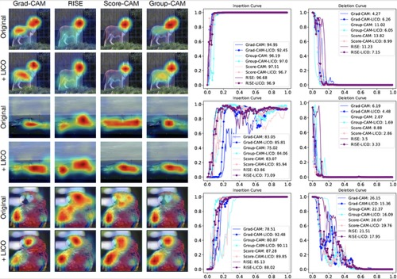

# LICO: Explainable Models with Language-Image COnsistency (NeurIPS 2023)

## Abstract & Framework
Framework of LICO is shown in the following figure:


## Results
Qualitative and quantitative results obtained by baselines and their LICO versions.


## Response to Reproducibility Study at TMLR

## References

If you find the code useful for your research, please consider citing
```bib
@inproceedings{lei2023lico,
  title={LICO: Explainable Models with Language-Image COnsistency},
  author={Lei, Yiming and Li, Zilong and Li, Yangyang and Zhang, Junping and Shan, Hongming},
  booktitle={Thirty-seventh Conference on Neural Information Processing Systems},
  year={2023}
}
```


